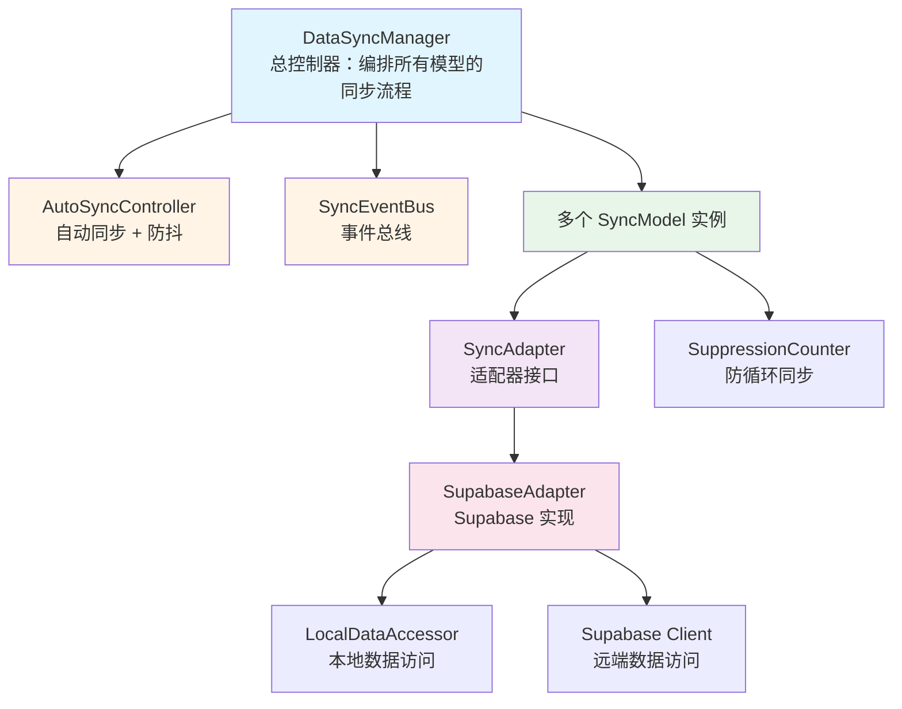
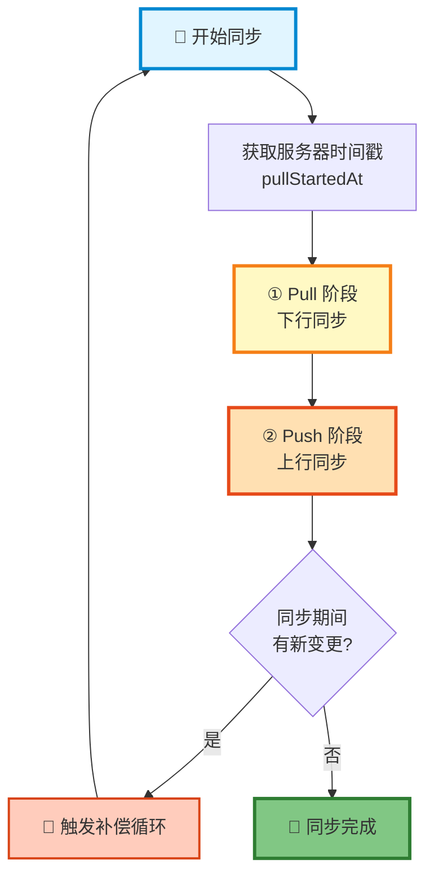
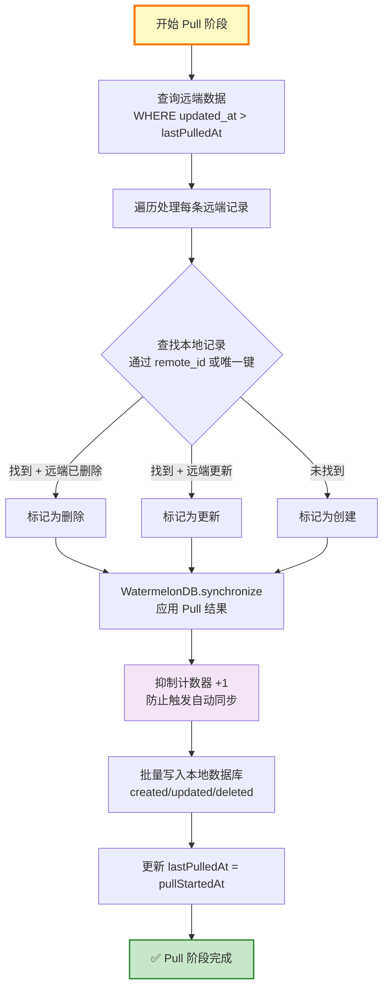
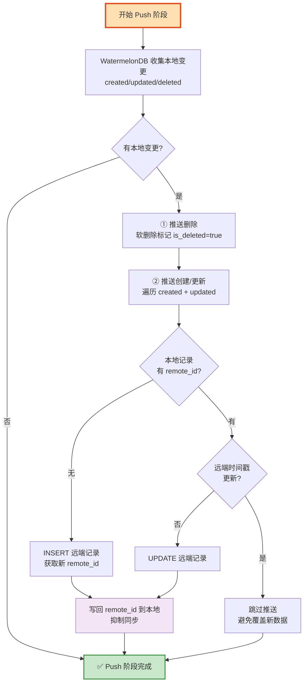
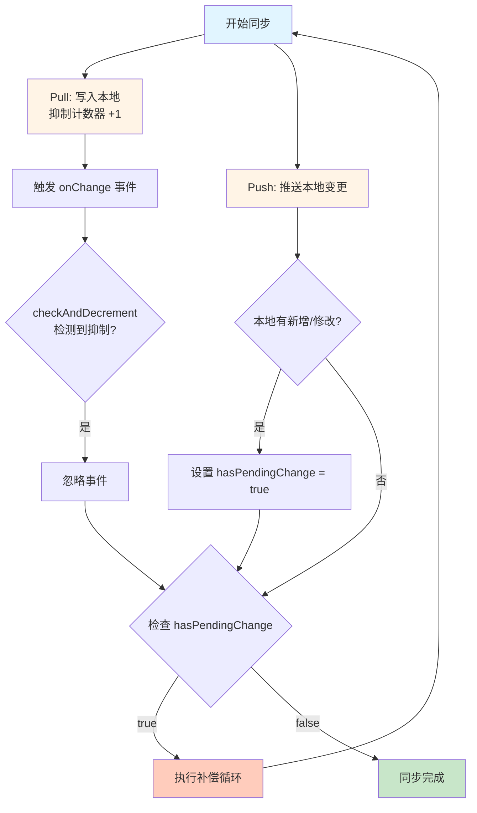
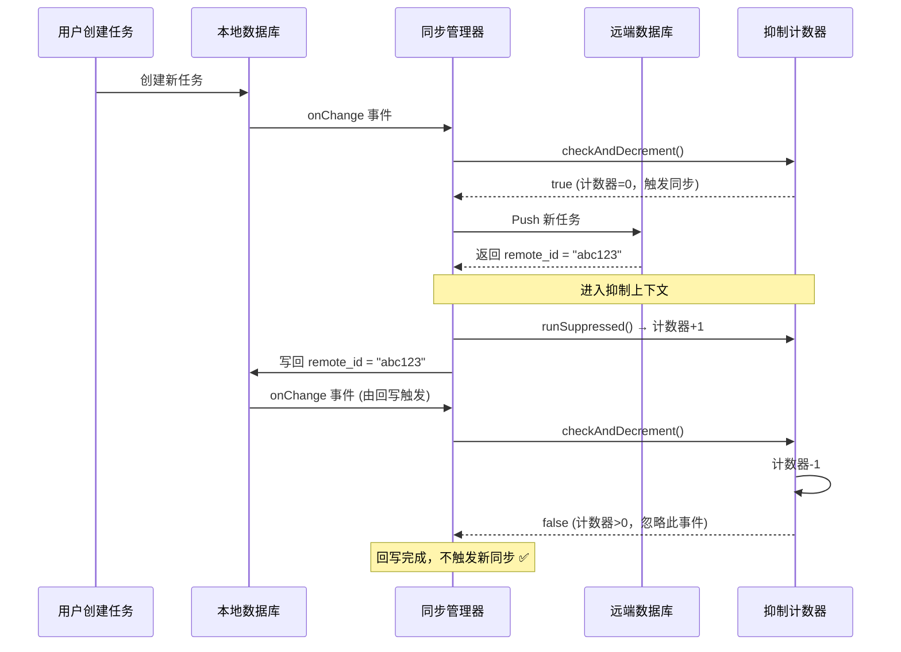

# 百变AI助手：Offline First 数据同步方案

> 🚀 开源地址：[https://github.com/Morphicai/watermelondb-sync-model](https://github.com/Morphicai/watermelondb-sync-model)  
> 基于 WatermelonDB + Supabase 的离线优先数据同步引擎

---

## 📌 关于本文

本文总结了百变AI助手中数据同步的完整实现思路，包括我们踩过的坑和解决方案。代码开源在 GitHub，但不是开箱即用的 —— 这是从生产项目中提取的核心逻辑。配合 AI 工具（Claude、GPT-4 等）理解文章内容后，可以适配到自己的项目中。

---

## 前言

百变AI助手是一个 AI 驱动的应用生成平台，用户通过自然语言生成各种小工具（待办清单、记账工具、习惯追踪器等），这些工具立即在应用内运行。

核心问题：**用户在 AI 生成的小工具中产生的数据，如何在多设备间实时同步？**

场景：用户在手机上记录健身数据，到办公室用电脑查看；在平板上编辑笔记，手机上继续修改 —— 所有设备数据保持一致，离线也能使用。

技术要求：
- 离线优先 - 无网络环境下流畅使用
- 实时同步 - 多设备数据秒级同步  
- 冲突解决 - 自动处理多端编辑
- 高性能 - 支持万级数据

我们基于 WatermelonDB + Supabase 构建了这个同步引擎，并将核心代码开源。

---

## WatermelonDB 简介

[WatermelonDB](https://github.com/Nozbe/WatermelonDB) 是一个高性能的响应式数据库，支持 React Native 和 React（Web）应用。

**核心特点：**
- **懒加载** - 不会一次性加载所有数据到内存
- **响应式** - 数据变化自动触发 UI 更新
- **高性能** - 万级数据依然流畅
- **跨平台** - iOS/Android（SQLite）、Web（IndexedDB）统一 API

### 基础使用示例

一个典型的 WatermelonDB 应用（不带同步）：

```typescript
// 1. 定义数据模型
import { Model } from '@nozbe/watermelondb';
import { field, date } from '@nozbe/watermelondb/decorators';

export class Task extends Model {
  static table = 'tasks';
  
  @field('title') title!: string;
  @field('completed') completed!: boolean;
  @date('created_at') createdAt!: Date;
}

// 2. 创建数据库
import { Database } from '@nozbe/watermelondb';
import SQLiteAdapter from '@nozbe/watermelondb/adapters/sqlite';

const adapter = new SQLiteAdapter({
  schema,
  dbName: 'myapp',
});

const database = new Database({
  adapter,
  modelClasses: [Task],
});

// 3. 增删改查
// 创建
const newTask = await database.write(async () => {
  return await database.get('tasks').create(task => {
    task.title = '完成技术文档';
    task.completed = false;
  });
});

// 查询（响应式）
const tasks = database.get('tasks')
  .query()
  .observe(); // 返回 Observable，数据变化时自动更新

// 更新
await newTask.update(task => {
  task.completed = true;
});

// 删除
await newTask.markAsDeleted();
```

### 为什么需要同步？

上面的代码可以完美运行在单个设备上，但存在问题：

```
❌ 问题 1：数据孤岛
用户在手机上创建的任务，电脑上看不到

❌ 问题 2：数据丢失风险
设备损坏或卸载应用，数据永久丢失

❌ 问题 3：无法协作
无法与其他用户共享或协作编辑数据
```

这就是我们需要同步的原因。WatermelonDB 提供了 `synchronize()` API，但需要我们自己实现具体的同步逻辑 —— 这就是本文的核心内容。

---

## 架构设计

### 核心理念

我们的同步系统遵循三大设计原则：

1. **声明式同步配置** - 通过继承 `SyncModel` 类，只需声明字段映射和转换规则，框架自动处理所有同步逻辑
2. **双向增量同步** - 基于时间戳的智能增量同步，最小化网络传输
3. **补偿式一致性** - 通过补偿循环确保数据最终一致性

### 系统架构图



---

## 核心组件详解

### 1️⃣ SyncModel - 同步模型基类

`SyncModel` 继承自 WatermelonDB 的 `Model` 类，在保留原有功能的基础上，增加了双向同步能力。

**继承关系：**
```typescript
// WatermelonDB 原生 Model
class Model { ... }

// 我们的 SyncModel 继承 Model
export abstract class SyncModel<LocalRaw, RemoteRow> extends Model {
  // 继承了 Model 的所有功能（CRUD、响应式等）
  // + 新增同步相关的静态配置和方法
}

// 你的业务模型继承 SyncModel
export class Task extends SyncModel<LocalTaskRaw, RemoteTask> {
  // 继承了 Model 的所有功能
  // + 继承了 SyncModel 的同步功能
  // + 你的业务字段和逻辑
}
```

**实际使用：**
```typescript
export class Task extends SyncModel<LocalTaskRaw, RemoteTask> {
  // ===== 来自 WatermelonDB Model 的功能 =====
  @text('title') title!: string;
  @text('remote_id') remoteId!: string;
  @date('updated_at') updatedAt!: Date;
  // 继承的方法：update()、markAsDeleted()、observe() 等
  
  // ===== 来自 SyncModel 的功能（需要实现） =====
  
  // 🔧 配置远端表名
  static remoteTable = 'tasks';
  
  // 🔧 配置主键和唯一键映射
  static syncKeys = {
    remotePk: 'id',              // 远端主键
    localRemoteId: 'remote_id',  // 本地存储远端 ID 的字段
    uniqueKey: {                 // 唯一键约束（可选）
      local: 'title',
      remote: 'title'
    }
  };
  
  // 🔧 配置时间戳字段（用于冲突检测）
  static syncTimestamps = {
    local: 'updated_at',
    remote: 'updated_at'
  };
  
  // 🔧 配置用户隔离（多租户）
  static scope = {
    userField: 'user_id'
  };
  
  // ⬇️ 下行数据转换：远端 → 本地
  static remoteToLocal(row: RemoteTask, ctx: SyncContext): LocalTaskRaw {
    return {
      id: `tasks:${row.id}`,  // 生成本地 ID
      title: row.title,
      remote_id: row.id,
      user_id: row.user_id,
      updated_at: Date.parse(row.updated_at)
    };
  }
  
  // ⬆️ 上行数据转换：本地 → 远端
  localToRemote(ctx: SyncContext): Partial<RemoteTask> {
    return {
      title: this.title,
      user_id: ctx.userId,
      updated_at: new Date(this.updatedAt).toISOString()
    };
  }
}
```

**为什么要继承 Model？**

这样设计的好处：
- ✅ **兼容性** - 完全兼容 WatermelonDB 的所有 API 和装饰器
- ✅ **渐进式** - 已有的 Model 可以平滑升级为 SyncModel
- ✅ **类型安全** - TypeScript 完整的类型推导
- ✅ **最小侵入** - 不改变原有的使用方式，只需增加同步配置

**使用 SyncModel 的完整示例：**

```typescript
export class Task extends SyncModel<LocalTaskRaw, RemoteTask> {
  static table = 'tasks';  // WatermelonDB 必需
  
  // WatermelonDB 字段定义
  @text('title') title!: string;
  @text('remote_id') remoteId!: string;
  @date('updated_at') updatedAt!: Date;
  
  // SyncModel 同步配置
  static remoteTable = 'tasks';
  static syncKeys = { remotePk: 'id', localRemoteId: 'remote_id' };
  static syncTimestamps = { local: 'updated_at', remote: 'updated_at' };
  
  // 数据转换方法
  static remoteToLocal(row: RemoteTask): LocalTaskRaw { ... }
  localToRemote(): Partial<RemoteTask> { ... }
}

// 使用时，和普通 Model 一样
const task = await database.get('tasks').create(t => {
  t.title = '完成文档';
  // 会自动触发同步！
});
```

**关键配置项说明：**

- `syncKeys.uniqueKey` - 支持单一或联合唯一键，用于首次同步时匹配已存在的记录
- `syncTimestamps` - 双端时间戳对比，实现"后写入获胜"的冲突解决策略
- `scope.userField` - 自动过滤当前用户的数据，配合 Supabase RLS 实现数据隔离

### 2️⃣ SyncAdapter - 适配器接口

`SyncAdapter` 是连接本地数据库和远端数据源的桥梁，定义了同步的核心契约。

**接口设计：**

```typescript
export interface SyncAdapter<LocalRaw, RemoteRow> {
  // 下行同步：从远端拉取数据
  pull(
    lastPulledAt: number | null,  // 上次同步时间
    ctx?: SyncContext              // 同步上下文（如 userId）
  ): Promise<PullResult<LocalRaw>>;
  
  // 上行同步：推送本地变更到远端
  push(
    changes: TableChanges<LocalRaw>,  // WatermelonDB 提供的变更
    ctx?: SyncContext
  ): Promise<void>;
  
  // 订阅远端数据变化（可选）
  subscribeToRemoteChanges(
    ctx?: SyncContext,
    onChange?: (payload?: unknown) => void
  ): RemoteSubscription;
}
```

**核心数据结构：**

```typescript
// Pull 返回结果
interface PullResult<LocalRaw> {
  created: LocalRaw[];  // 新建记录
  updated: LocalRaw[];  // 更新记录
  deleted: string[];    // 删除记录的 ID 列表
}

// Push 输入参数
interface TableChanges<LocalRaw> {
  created: LocalRaw[];  // 本地新建的记录
  updated: LocalRaw[];  // 本地更新的记录
  deleted: string[];    // 本地删除的记录 ID
}
```

**BaseSyncAdapter 基类：**

提供了通用的工具方法，简化子类实现：

```typescript
export abstract class BaseSyncAdapter<LocalRaw, RemoteRow> 
  implements SyncAdapter<LocalRaw, RemoteRow> {
  
  protected readonly database: Database;
  protected readonly ModelCtor: SyncModelCtor;
  protected readonly localData: LocalDataAccessor;  // 本地数据访问工具
  
  // 子类必须实现
  abstract pull(lastPulledAt, ctx?): Promise<PullResult>;
  abstract push(changes, ctx?): Promise<void>;
  
  // 通用工具方法
  protected normalizeUniqueSpecs(uniqueKey): UniqueKeySpec[] { ... }
  protected getRemoteUniqueKey(row, uniqueSpecs): string { ... }
  protected normalizeSoftDelete(row, field?): boolean { ... }
  protected serializeUniqueValues(values): string { ... }
}
```

**为什么需要适配器模式？**

```typescript
// 解耦数据源
SyncModel → SyncAdapter → 远端数据源
            ↓
    SupabaseAdapter (Supabase)
    FirebaseAdapter (Firebase)
    GraphQLAdapter (GraphQL API)
    RestAdapter (REST API)
```

这样设计的好处：
- 更换数据源时，只需实现新的 Adapter
- SyncModel 和 DataSyncManager 无需修改
- 可以为不同的表使用不同的 Adapter

**SupabaseAdapter 实现示例：**

我们提供了基于 Supabase 的完整实现（见代码仓库），核心逻辑：

```typescript
export class SupabaseAdapter extends BaseSyncAdapter {
  async pull(lastPulledAt, ctx) {
    // 1. 查询远端更新的数据
    const { data } = await supabase
      .from(this.ModelCtor.remoteTable)
      .select('*')
      .gte('updated_at', new Date(lastPulledAt).toISOString())
      .eq('user_id', ctx.userId);
    
    // 2. 匹配本地记录（通过 remote_id 或唯一键）
    // 3. 分类为 created/updated/deleted
    // 4. 调用 remoteToLocal 转换数据
    
    return { created, updated, deleted };
  }
  
  async push(changes, ctx) {
    // 1. 处理删除（软删除标记）
    // 2. 处理创建和更新（INSERT or UPDATE）
    // 3. 写回 remote_id 到本地
  }
  
  subscribeToRemoteChanges(ctx, onChange) {
    // 使用 Supabase Realtime 订阅表变化
    const channel = supabase.channel(`sync-${table}`)
      .on('postgres_changes', { event: '*', table }, onChange)
      .subscribe();
    
    return { unsubscribe: () => supabase.removeChannel(channel) };
  }
}
```

### 3️⃣ DataSyncManager - 同步总控

`DataSyncManager` 是整个同步系统的大脑，负责：

- 📋 注册和管理所有同步模型
- 🔄 编排 Pull/Push 同步流程
- 🎯 触发补偿循环确保一致性
- 📡 管理本地变更监听和远端实时订阅

```typescript
// 创建同步管理器
const syncManager = new DataSyncManager(
  database,
  [Task, Note, Message],  // 注册所有需要同步的模型
  { debounceMs: 3000 }    // 防抖时间（毫秒）
);

// 启动同步（执行初始同步 + 启用自动同步）
await syncManager.start(
  { userId: currentUser.id },
  { auto: true }  // 启用自动同步
);

// 手动触发同步
await syncManager.syncNow({ userId: currentUser.id });

// 监听同步事件
syncManager.on((event) => {
  if (event.type === 'pulled') {
    console.log(`${event.label} 下行同步完成`, event.detail);
  }
  if (event.type === 'error') {
    console.error(`${event.label} 同步失败`, event.detail);
  }
});

// 启动远端实时订阅（可选）
syncManager.startRemoteSubscriptions();
```

### 4️⃣ LocalDataAccessor - 本地数据访问

封装了所有本地 WatermelonDB 的操作，提供统一的数据访问接口：

```typescript
export class LocalDataAccessor {
  // 根据 remote_id 查找本地记录
  async findByRemoteId(localRemoteIdKey, remoteIdValue): Promise<Model | null>
  
  // 构建唯一键索引（用于首次同步匹配）
  async buildUniqueIndex(uniqueSpecs): Promise<Map<string, Model>>
  
  // 读取字段值（支持 snake_case/camelCase 转换）
  readField(record, fieldName): any
  
  // 获取时间戳（统一转换为毫秒）
  getTimestamp(record, fieldName): number
  
  // 在抑制上下文中执行（避免触发同步）
  updateWithoutSync(fn): Promise<void>
}
```

---

## 同步流程详解

在深入一致性机制之前，我们先了解 WatermelonDB 的同步流程。**关键点：Pull 和 Push 有严格的执行顺序。**

### 📋 单次同步循环流程概览



### 🔽 阶段一：Pull（下行同步）

从远端拉取数据，更新本地数据库。



**Pull 阶段核心逻辑：**

```typescript
async runPullPhase({ models, ctx, lastPulledAt }) {
  for (const model of models) {
    const adapter = model.createAdapter(this.database);
    
    // 1. 从远端拉取增量数据
    const { created, updated, deleted } = await adapter.pull(
      lastPulledAt,
      ctx
    );
    
    // 2. 返回给 WatermelonDB 应用到本地
    return {
      changes: { [model.table]: { created, updated, deleted } },
      timestamp: Date.now()  // 新的 lastPulledAt
    };
  }
}
```

**关键步骤：**

1. **查询远端** - 只拉取 `updated_at > lastPulledAt` 的记录（增量同步）
2. **匹配本地** - 通过 `remote_id` 或 `uniqueKey` 找到对应本地记录
3. **分类处理**：
   - 远端已删除 → 标记本地删除
   - 本地不存在 → 标记为创建
   - 本地存在 → 标记为更新
4. **批量写入** - WatermelonDB 在抑制上下文中批量应用变更
5. **更新时间戳** - 记录本次同步时间点

### 🔼 阶段二：Push（上行同步）

推送本地变更到远端。



**Push 阶段核心逻辑：**

```typescript
async runPushPhase({ models, ctx, changes }) {
  for (const model of models) {
    const adapter = model.createAdapter(this.database);
    const tableChanges = changes[model.table];
    
    if (!tableChanges) continue;
    
    // 1. 先推送删除（软删除标记）
    await this.pushDeletes(tableChanges.deleted);
    
    // 2. 后推送创建和更新
    for (const record of [...tableChanges.created, ...tableChanges.updated]) {
      // 检查是否有 remote_id
      if (record.remoteId) {
        // 有 remote_id → UPDATE 远端
        await supabase
          .from(model.remoteTable)
          .update(model.localToRemote(record, ctx))
          .eq('id', record.remoteId);
      } else {
        // 无 remote_id → INSERT 远端
        const { data } = await supabase
          .from(model.remoteTable)
          .insert(model.localToRemote(record, ctx))
          .select()
          .single();
        
        // 写回 remote_id 到本地（抑制同步）
        await this.writeBackRemoteId(record, data.id);
      }
    }
  }
}
```

**关键步骤：**

1. **收集变更** - WatermelonDB 自动追踪本地变更
2. **先删除后创建** - 避免主键/唯一键冲突
3. **判断操作类型**：
   - 有 `remote_id` → UPDATE 远端记录
   - 无 `remote_id` → INSERT 新记录
4. **时间戳冲突检测** - 避免覆盖远端更新的数据
5. **写回 remote_id** - 在抑制上下文中更新本地记录

### 🔑 关键顺序说明

#### 1. **为什么先 Pull 后 Push？**

这是 WatermelonDB 的设计原则，确保数据一致性：

```typescript
// DataSyncManager.ts - runSingleSyncCycle
await synchronize({
  database: this.database,
  
  // ① 先执行 Pull
  pullChanges: async ({ lastPulledAt }) => {
    return await this.runPullPhase({ models, ctx, lastPulledAt });
  },
  
  // ② 后执行 Push
  pushChanges: async ({ changes }) => {
    return await this.runPushPhase({ models, ctx, changes });
  },
});
```

**执行顺序的好处：**

| 顺序 | 阶段 | 作用 | 结果 |
|------|------|------|------|
| ① | **Pull 先执行** | 从远端获取最新数据 | 本地数据库更新到最新状态 |
| ② | **Push 后执行** | 推送本地变更 | 推送的是结合了远端最新数据后的状态 |

**场景示例：**

```
初始状态：
- 本地任务 A：title = "写文档"（本地修改，未同步）
- 远端任务 A：title = "撰写技术文档"（其他设备修改）

同步流程：
1. Pull 阶段：发现远端更新 → 本地更新为 "撰写技术文档"
2. Push 阶段：收集本地变更 → 发现没有未同步的变更（因为已被 Pull 覆盖）
3. 结果：避免了冲突，本地和远端一致

如果顺序反过来（先 Push 后 Pull）：
1. Push 阶段：推送 "写文档" 到远端 → 覆盖了 "撰写技术文档"
2. Pull 阶段：从远端拉取 "写文档" 
3. 结果：其他设备的修改丢失了！❌
```

#### 2. **Push 内部的执行顺序**

Push 阶段内部也有严格顺序：

```typescript
async push(changes) {
  // ① 先处理删除
  await this.pushDeletes(changes.deleted);
  
  // ② 后处理创建和更新
  await this.pushUpserts([
    ...changes.created,
    ...changes.updated
  ]);
}
```

**为什么先删除后创建？**

避免主键冲突：

```
场景：用户删除任务 A，然后创建了同名任务 A'

错误顺序（先创建后删除）：
1. 创建任务 A' → 主键冲突（A 还在）❌
2. 删除任务 A

正确顺序（先删除后创建）：
1. 删除任务 A → 主键释放
2. 创建任务 A' → 成功 ✅
```

#### 3. **时间戳获取时机**

Pull 阶段开始前就获取服务器时间戳：

```typescript
async runPullPhase({ lastPulledAt }) {
  // ① 先获取服务器时间戳（作为本次 Pull 的开始时间）
  const pullStartedAt = await this.fetchServerTime();
  
  // ② 查询 updated_at > lastPulledAt 的数据
  const rows = await supabase
    .from('tasks')
    .select('*')
    .gte('updated_at', new Date(lastPulledAt).toISOString());
  
  // ③ Pull 完成后，更新 lastPulledAt = pullStartedAt
  return { changes, timestamp: pullStartedAt };
}
```

**为什么不用 Pull 结束时的时间？**

避免遗漏数据：

```
场景：Pull 耗时 5 秒

错误做法（用 Pull 结束时间）：
10:00:00 - Pull 开始
10:00:02 - 远端插入新记录 X
10:00:05 - Pull 结束，设置 lastPulledAt = 10:00:05
下次 Pull：查询 updated_at > 10:00:05 的数据
结果：记录 X 丢失！❌（因为它的时间戳是 10:00:02）

正确做法（用 Pull 开始时间）：
10:00:00 - 获取 pullStartedAt = 10:00:00，Pull 开始
10:00:02 - 远端插入新记录 X
10:00:05 - Pull 结束，设置 lastPulledAt = 10:00:00
下次 Pull：查询 updated_at > 10:00:00 的数据
结果：记录 X 会被拉取 ✅
```

---

## 数据一致性保证机制

这是整个方案最核心的部分。我们通过多层机制确保数据在复杂场景下的一致性。

### ⏱️ 1. 时间戳冲突检测

**场景：** 用户在手机和电脑上同时编辑同一条笔记。

**解决方案：**

1. 双端维护 `updated_at` 时间戳（毫秒精度）
2. Pull 时比较 `remoteUpdatedAt > localUpdatedAt`，远端更新则覆盖本地
3. Push 时先查询远端最新时间戳，如果远端更新则跳过推送（避免覆盖）

```typescript
// 下行同步时的冲突检测
if (isFinite(remoteUpdated) && remoteUpdated > localUpdated) {
  // 远端更新，覆盖本地
  updated.push({ ...remoteToLocal(row), id: localRecord.id });
}

// 上行同步时的冲突检测
const remoteRow = await fetchRemoteRow(remoteTable, remoteId);
const remoteUpdated = Date.parse(remoteRow.updated_at);
const localUpdated = Number(model.updatedAt);

if (remoteUpdated >= localUpdated) {
  // 远端更新，跳过推送（避免覆盖新数据）
  return;
}
```

**冲突解决策略：** "**Last Write Wins**"（后写入获胜）- 简单高效，适合绝大多数场景。

### 🔑 2. 唯一键匹配

**场景：** 用户在离线状态下创建了一条任务，随后在另一台设备也创建了同名任务。

**问题：** 如何避免同步后产生重复数据？

**解决方案：** 联合唯一键匹配

```typescript
static syncKeys = {
  remotePk: 'id',
  localRemoteId: 'remote_id',
  uniqueKey: [
    { local: 'title', remote: 'title' },
    { local: 'user_id', remote: 'user_id' }
  ]  // 联合唯一键：title + user_id
};
```

**同步流程：**

1. 首次同步时，系统先构建本地唯一键索引 `Map<uniqueKey, localRecord>`
2. 对于每条远端记录，先尝试通过 `remote_id` 匹配
3. 如果匹配失败，再通过 `uniqueKey` 匹配
4. 匹配成功则更新，失败则创建新记录

```typescript
// 构建本地唯一键索引
const uniqueIndex = await buildUniqueIndex(uniqueSpecs);
// uniqueIndex: Map { "任务A##user123" => localRecord1, ... }

// 匹配远端记录
let localRecord = await findByRemoteId(row.id);
if (!localRecord) {
  const uniqueKey = getRemoteUniqueKey(row, uniqueSpecs);
  localRecord = uniqueIndex.get(uniqueKey);
}
```

**关键点：**
- 支持单一或联合唯一键（数组）
- 支持 JSON 路径（如 `data.email`）
- 发现重复唯一键会抛出错误，确保数据完整性

### 🗑️ 3. 软删除机制

**为什么不能硬删除？**

硬删除会导致同步信息丢失：
- 设备 A 删除记录后，设备 B 无法感知这次删除
- 设备 B 下次同步时会将"已删除的记录"重新推送到云端（僵尸数据）

**软删除方案：**

```typescript
// 本地删除时，标记 is_deleted = true，而非物理删除
await task.update(t => {
  t.isDeleted = true;
  t.updatedAt = Date.now();
});

// Push 时将软删除标记同步到远端
const { error } = await supabase
  .from('tasks')
  .update({ is_deleted: true, updated_at: new Date().toISOString() })
  .eq('id', remoteId);

// Pull 时识别软删除，触发本地删除
if (row.is_deleted) {
  deleted.push(localRecord.id);
}
```

**数据清理：** 定期通过后台任务物理删除 `is_deleted=true` 且超过 N 天的记录。

### 🔄 4. 补偿循环（Compensation Cycles）

**场景：** 同步过程中本地数据被修改，如何确保数据最终一致？

**问题示例：**

1. Pull 阶段：从远端拉取 100 条记录并写入本地
2. 这会触发 WatermelonDB 的 `onChange` 事件
3. 如果立即触发新的同步，会导致递归同步

**解决方案：补偿循环 + 抑制计数器**

```typescript
async runSyncLoop(models, ctx) {
  this.isSyncing = true;
  
  // 持续同步直到稳定
  while (true) {
    await runSingleSyncCycle(models, ctx);  // Pull + Push
    
    if (!this.hasPendingChange) {
      break;  // 没有新的变更，退出循环
    }
    
    // 有新变更，执行补偿循环
    this.hasPendingChange = false;
  }
  
  this.isSyncing = false;
}
```

**抑制计数器（SuppressionCounter）：**

```typescript
// Pull 写入本地时，抑制同步触发
runSuppressed(async () => {
  await database.write(async () => {
    await model.update(m => {
      m.remoteId = remoteId;
      m.updatedAt = remoteUpdatedAt;
    });
  });
});

// 本地变更监听器中检查抑制状态
onLocalChanged(changes) {
  if (!checkAndDecrement()) {
    return;  // 正在抑制中，忽略此次变更
  }
  
  this.scheduleAutoSync();
}
```

**流程图：**



### ⚡ 5. 防抖与批量处理

**场景：** 用户快速连续输入笔记标题，每次按键都触发同步？

**解决方案：AutoSyncController 防抖**

```typescript
export class AutoSyncController {
  private debounceTimer: any;
  
  trigger(onTrigger: () => void) {
    // 清除之前的定时器
    if (this.debounceTimer) clearTimeout(this.debounceTimer);
    
    // 设置新的定时器（默认 3000ms）
    this.debounceTimer = setTimeout(() => {
      this.debounceTimer = null;
      onTrigger();
    }, this.debounceMs);
  }
}
```

**效果：** 连续编辑 10 秒内只触发一次同步，大幅减少网络请求。

### 📡 6. 实时订阅（Remote Subscriptions）

**场景：** 用户在手机上查看任务列表，此时电脑上完成了一个任务，如何实时更新？

**解决方案：Supabase Realtime + 自动同步触发**

```typescript
// 启动远端实时订阅
syncManager.startRemoteSubscriptions();

// SupabaseAdapter 实现
subscribeToRemoteChanges(ctx, onChange) {
  const channel = supabase.channel(`sync-${this.ModelCtor.table}`)
    .on('postgres_changes', {
      event: '*',
      schema: 'public',
      table: this.ModelCtor.remoteTable,
      filter: `user_id=eq.${ctx.userId}`  // 仅订阅当前用户数据
    }, (payload) => {
      // 触发同步
      onChange?.(payload);
    })
    .subscribe();
  
  return {
    unsubscribe: () => supabase.removeChannel(channel)
  };
}
```

**智能暂停机制：** Push 期间暂停该表的订阅，避免自己触发自己

```typescript
// Push 前暂停订阅
if (wasSubscribed) {
  this.unsubscribeFromModel(label);
}

try {
  await adapter.push(changes, ctx);
} finally {
  // Push 后立即恢复订阅
  if (wasSubscribed) {
    this.subscribeToModel(ctor, label);
  }
}
```

### 🔐 7. 远端 ID 回写（Remote ID Write-back）

**场景：** 本地创建一条记录，Push 到远端后获得远端 ID，如何关联？

#### 问题：回写导致循环同步

当我们写回 `remote_id` 到本地数据库时，会遇到一个棘手的问题：

```typescript
// ❌ 危险操作：直接写回会触发循环
await model.update(m => {
  m.remoteId = remoteId;  // 这会触发 WatermelonDB 的 onChange 事件
  m.updatedAt = remoteUpdated;
});

// onChange 事件被触发
// → AutoSyncController 监听到变更
// → 触发新的同步
// → Push 时再次写回
// → 又触发 onChange
// → 无限循环！💥
```

**核心矛盾：**
- 我们必须写回 `remote_id` 和 `updated_at`（建立本地-远端关联）
- 但任何本地数据库的写操作都会触发 `onChange` 事件
- 如果不处理，会导致无限循环同步

#### 解决方案：抑制计数器（SuppressionCounter）

我们通过一个全局计数器来标记"这是同步过程中的内部写操作，不应该触发新的同步"：

```typescript
// SuppressionCounter.ts
let suppressionDepth = 0;

// 在抑制上下文中执行函数
export function runSuppressed<T>(fn: () => Promise<T>): Promise<T> {
  suppressionDepth += 1;  // 进入抑制上下文，计数器 +1
  return fn();
}

// 检查是否应该触发同步
export function checkAndDecrement(): boolean {
  const wasZero = suppressionDepth <= 0;  // 计数器为 0 说明是真实的用户操作
  suppressionDepth = Math.max(0, suppressionDepth - 1);  // 计数器 -1
  return wasZero;  // 返回 true 表示应该触发同步
}
```

#### 完整的工作流程



#### 代码实现

```typescript
// 1. Push 阶段：创建远端记录
const { data } = await supabase
  .from('tasks')
  .insert(payload)
  .select();

const remoteId = data[0].id;

// 2. 在抑制上下文中写回本地
await writeBackRemoteId(model, {
  localRemoteId: 'remote_id',
  remoteId: remoteId,
  remoteUpdatedAtKey: 'updated_at',
  remoteRow: data[0]
});

// writeBackRemoteId 内部实现
async function writeBackRemoteId(model, params) {
  const updateData = async () => {
    await database.write(async () => {
      await model.update(m => {
        m.remoteId = params.remoteId;        // 写回远端 ID
        m.updatedAt = params.remoteUpdatedAt; // 同步时间戳
      });
    });
  };
  
  // ✅ 关键：在抑制上下文中执行
  await runSuppressed(updateData);
}

// 3. AutoSyncController 中的变更监听
onLocalChanged(changes) {
  // ✅ 检查抑制状态
  if (!checkAndDecrement()) {
    // 计数器 > 0，说明是同步内部操作，忽略
    return;
  }
  
  // 计数器 = 0，说明是真实用户操作，触发同步
  if (!changes || !this.running) return;
  
  if (this.isSyncing) {
    this.hasPendingChange = true;
    return;
  }
  
  this.scheduleAutoSync();
}
```

#### 关键点总结

| 场景 | suppressionDepth | checkAndDecrement() | 行为 |
|------|-----------------|---------------------|------|
| **用户创建任务** | 0 | true | ✅ 触发同步 |
| **Pull 写入本地** | 1 | false | ❌ 忽略（同步内部操作） |
| **回写 remote_id** | 1 | false | ❌ 忽略（同步内部操作） |
| **同步完成后用户编辑** | 0 | true | ✅ 触发同步 |

**为什么需要计数器而不是布尔值？**

因为可能存在嵌套的写操作：
```typescript
runSuppressed(async () => {
  await model1.update(...);  // 深度 1
  await runSuppressed(async () => {
    await model2.update(...);  // 深度 2
  });
});
// 只有所有抑制上下文都退出后，才能触发同步
```

**同步完整性保证：**
- ✅ 真实用户操作 → 立即触发同步
- ✅ 同步内部写回 → 不触发循环
- ✅ 嵌套写操作 → 正确处理
- ✅ 并发安全 → 单线程 JavaScript 保证原子性

---

## 高级特性

### 自定义适配器

如果你使用的不是 Supabase，可以实现自定义适配器：

```typescript
import { BaseSyncAdapter, PullResult, TableChanges } from '@/lib/sync';

export class FirebaseAdapter extends BaseSyncAdapter {
  async pull(lastPulledAt: number | null, ctx?: SyncContext): Promise<PullResult> {
    // 实现 Firebase 拉取逻辑
    const snapshot = await firebase
      .collection(this.ModelCtor.remoteTable)
      .where('updated_at', '>', lastPulledAt)
      .where('user_id', '==', ctx.userId)
      .get();
    
    // 转换为 PullResult 格式
    return {
      created: [...],
      updated: [...],
      deleted: [...]
    };
  }
  
  async push(changes: TableChanges, ctx?: SyncContext): Promise<void> {
    // 实现 Firebase 推送逻辑
    // ...
  }
}

// 在 Model 中指定使用自定义适配器
export class Task extends SyncModel {
  protected static createAdapter(database, ModelCtor, defaultCtx) {
    return new FirebaseAdapter(database, ModelCtor);
  }
}
```

### 条件同步（Record-Level Filtering）

某些记录可能不需要同步到云端（如临时草稿），可以通过 `shouldSyncLocal` 控制：

```typescript
export class Draft extends SyncModel {
  @field('is_synced') isSynced!: boolean;
  
  async shouldSyncLocal(ctx: SyncContext): Promise<boolean> {
    // 只同步已标记为"需同步"的草稿
    return this.isSynced;
  }
}
```

### 冲突回调（Conflict Hooks）

虽然默认使用"后写入获胜"策略，但你可以监听冲突事件并自定义处理：

```typescript
syncManager.on((event) => {
  if (event.type === 'conflict') {
    const { localRecord, remoteRecord } = event.detail;
    
    // 自定义冲突解决逻辑
    const merged = mergeConflicts(localRecord, remoteRecord);
    await localRecord.update(merged);
  }
});
```

---

## 故障排查

### 常见问题

**1. 循环同步（数据反复更新）**

**原因：** 未正确使用抑制计数器

**解决：** 写回 `remote_id` 时使用 `runSuppressed`

```typescript
// 正确
runSuppressed(async () => {
  await model.update(m => m.remoteId = remoteId);
});

// 错误：直接更新会触发新的同步
await model.update(m => m.remoteId = remoteId);
```

**2. 唯一键冲突**

**错误信息：** `Local unique key duplicated for tasks: ...`

**原因：** 本地存在多条记录具有相同唯一键

**解决：** 检查数据完整性约束

```sql
-- 在 Supabase 中添加唯一约束
ALTER TABLE tasks 
ADD CONSTRAINT tasks_title_user_unique 
UNIQUE (title, user_id);
```

**3. 时间戳不同步**

**现象：** Pull 后立即 Push 相同数据

**原因：** 客户端和服务器时间偏差

**解决：** 使用服务器时间

```typescript
// 获取服务器时间
const { timestamp } = await getServerTime();

// 更新记录时使用服务器时间
await model.update(m => {
  m.updatedAt = timestamp;
});
```

---

## 致谢

这个项目的灵感来源于：

- [WatermelonDB](https://github.com/Nozbe/WatermelonDB) - 出色的移动端数据库
- [Supabase](https://supabase.com/) - 强大的后端即服务平台
- [RxDB](https://rxdb.info/) - 另一个优秀的响应式数据库方案

---

## 关注与交流

如果这篇文章对你有帮助，欢迎：

- ⭐ **Star 项目**：[github.com/Morphicai/watermelondb-sync-model](https://github.com/Morphicai/watermelondb-sync-model)
- 💬 **分享经验**：在 GitHub Issues 中分享你的踩坑经验和解决方案
- 🐛 **报告问题**：发现 Bug 或有改进建议？提交 Issue 或 PR
- 📖 **交流讨论**：在 Discussions 中讨论同步架构、最佳实践

**你的实践经验对其他开发者很有价值！** 无论是成功案例还是踩过的坑，都欢迎在 GitHub 上分享。

---

## 总结

本文介绍了百变AI助手中 Offline First 数据同步的完整实现：

**核心内容：**
- 架构设计：SyncModel 抽象、适配器模式、事件驱动
- 一致性保证：时间戳冲突检测、唯一键匹配、软删除、补偿循环、抑制计数器
- 工程实践：Pull/Push 顺序、时间戳获取、远端 ID 回写
- 常见陷阱：循环同步、唯一键冲突、时间戳不同步

**关于开源代码：**

代码不是开箱即用的，这是从生产环境中提取的核心逻辑。文章详细说明了实现原理和我们遇到的问题，这些经验可以帮助你避免同样的坑。配合 AI 工具（Claude、GPT-4 等）可以快速理解并适配到自己的项目中。

---

## 🌟 我的其他开源项目

| 项目 | 描述 |
|------|------|
| [MorphixAI Code](https://github.com/Morphicai/morphixai-code) | 可以利用 Cursor / Claude Code 等 AI 工具快速上线自己的小工具 |
| [Awesome MorphixAI Apps](https://github.com/Morphicai/awesome-morphix-apps) | 基于 MorphixAI Code 的应用案例集合，展示最佳实践 |

---

*本文撰写于 2025 年 10 月，基于 watermelondb-sync-model v1.0.0*
